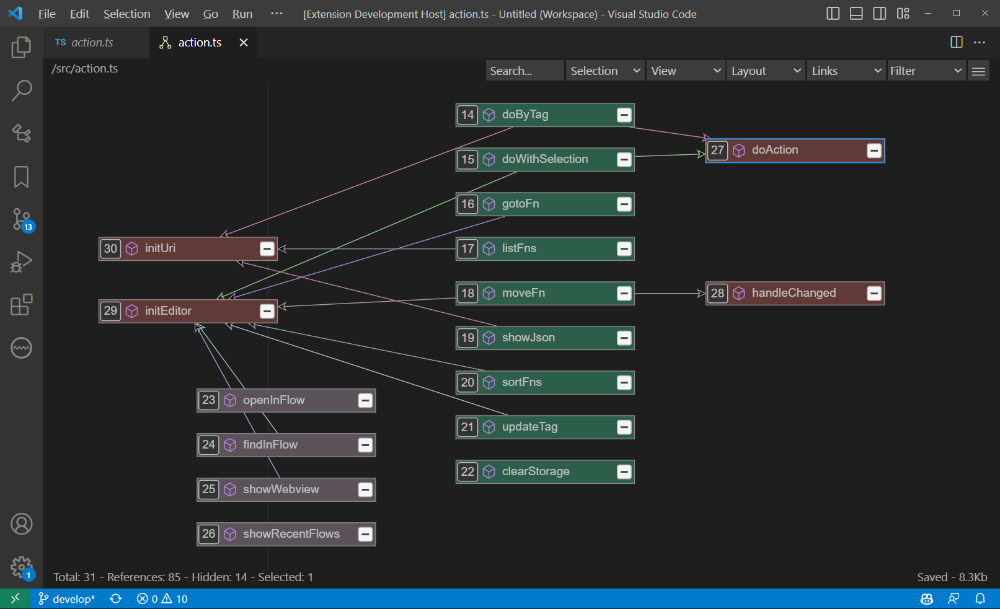
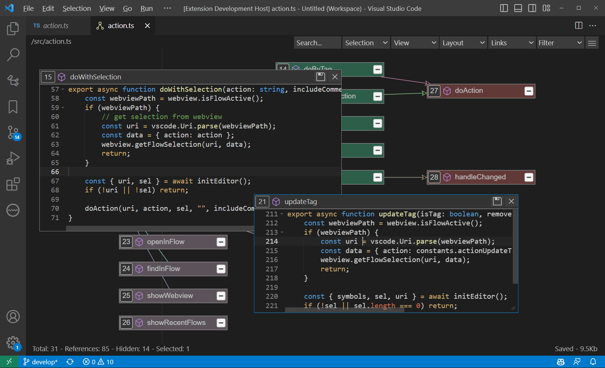
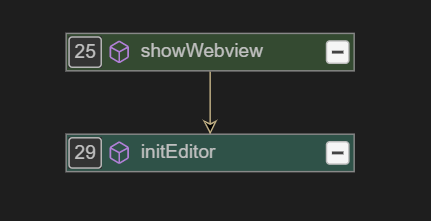
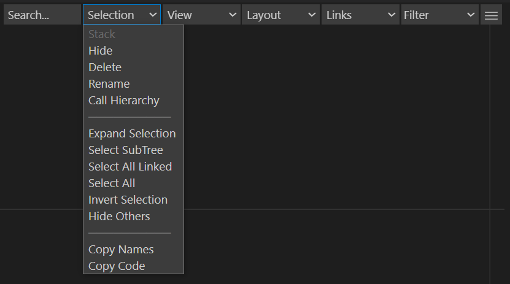
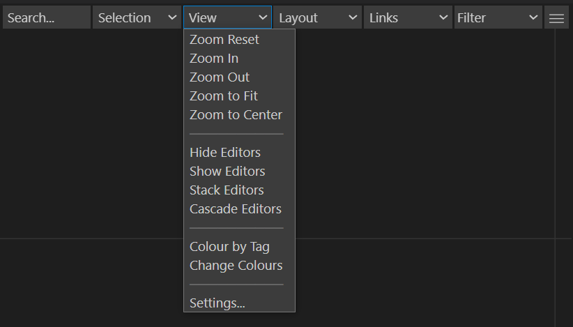
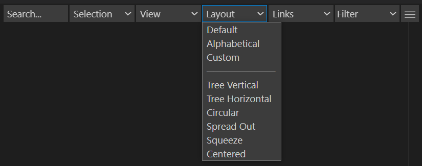
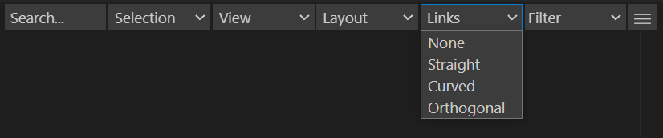

# Code Organiser README

Code Organiser provides editor commands to select, go to, move and sort functions/symbols via an interactive outline flow diagram.

Edit code in a popup editor.

## Features

Select Function features

-   Select current function
    -   Selects current function(s)
-   Select current function with comments
    -   Selects current function(s) with comments
-   Select functions with tag
    -   Selects all functions with the specified tag

Go to Function features

-   Go to next function
-   Go to previous function
-   Go to first function
-   Go to last function

Move Function features

-   Move function down
-   Move function up
-   Move function to top
-   Move function to end
-   Move function to position - select position from drop-down
-   Move to new file
-   Move to existing file

Move Function by tag

-   Move by tag to end
-   Move by tag to new file
-   Move by tag to existing file

Sort Functions features

-   Operates on selected functions or all if none selected.

-   Sort by Type
    -   Moves functions to the end and all other symbols to the top
-   Sort by Name
    -   Sort functions by name
-   Sort by Tag
    -   Sort functions by the specified tag
-   Sort by List

    -   Sort functions according to function list (Use 'List Functions' command to create).

-   List Functions - Creates a list of the functions
-   List Functions by Occurence - Creates a comment at the top of the code, with a list of the functions in the order in which they are called..
-   The list can be used to define the order of the functions, use the 'Sort by List' command.

Tag Functions features

-   Add/Update Tag
-   Add/Update Tag Again
    -   Add or update the tag of selected functions
-   Remove Tag
    -   Remove the tag of all selected functions
-   Add Comment
    -   Add a comment all selected functions

Flow features

-   Show Flow
    -   Open flow diagram for current editor
-   Open in Flow
    -   Browse to file to open in flow diagram
-   Open in Flow
    -   Select recent flow diagram

Flow Menu

-   A node is displayed in the flow diagram for each symbol. The node shows the counter/position in code, the symbol type icon and the symbol name.
-   Arrow links show other symbols referenced within the function.
-   Click the counter button to navigate to the symbol in code editor.
-   Hover to show/edit the comment.
-   Enter/Double-click to open code editor.
-   Drag to move the node,
-   Delete to hide the node.
-   Ctrl+Delete to delete the symbol from the code.

Selection Menu

-   Stack, hide, delete, rename, show call hierarchy
-   Invert selection, hide others, expand selection, select subtree, select all linked
-   Copy names, copy code

View Menu

-   Zoom reset, in, out, centre, to fit
-   Editors - show, hide, stack, cascade
-   Colour by Tags
    -   Set background colour of nodes in flow diagram according to tag.

Layout Menu

-   Default
-   Alphabetical
-   Custom - keep node/editor positions but stop auto-layout.
-   Tree Vertical - logical order of functions.
-   Tree Horizontal - logical order of functions.
-   Circular
-   Spread out - Move connected nodes further apart.
-   Squeeze - Move connected nodes closer together.
-   Centered - maintains a centre position for the diagram.

Links Menu

-   Set link style - none, straight, curved, orthogonal

Filter Menu

-   Filter by symbols type, e.g. import, variable, constant, function, reference

Other features

-   Show Commands
    -   Show extension commands in Command Palette
-   Show Symbols data
    -   Show JSON of symbols found in code
-   Show Storage
    -   Show Storage folder
-   Clear Storage
    -   Empty the storage folder
-   Open Settings
    -   Show extension settings

## Requirements

No requirements or dependencies

## Extension Settings

This extension contributes the following settings:

-   `codeorganiser.config.autoFormat`: Format code after changes

## Known Issues

## Release Notes

Initial release

### 1.0.13

Initial release
